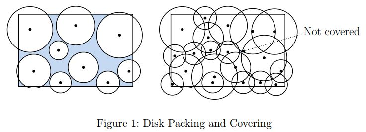
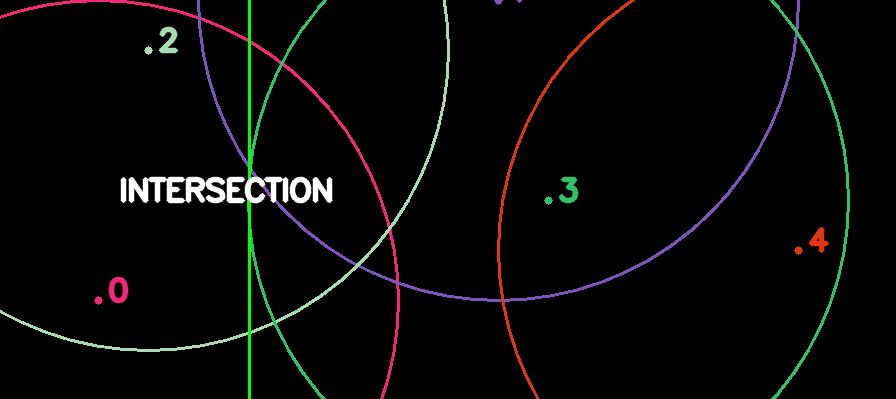

# Plane-Sweep-packing-cover

> Project for Geometric Alghoritms course @USI 20/21. 

#### Programming project description:

Let $R$ be an axis-parallel rectangle and $D = \{d_1,...d_n\}$ a collection of closed circular disks.

Each disk $d_i$ is represented by its center $p_i$, which lies within $R$, and its positive radius $r_i$. Disks may extend outside of $R$, and one disk may be contained within another.

- If every point of $R$ lies within at most one disk of $D$ (see left Figure 1) then we say that the elements of $D$ form a packing of $R$. Implement a plane-sweep $O(n log n)$ time algorithm that determines whether $D$ is a packing of $R$.

- If every point of $R$ lies within at least one disk of $D$ then we say that the elements of $D$ form a cover of $R$. See right Figure 1: the disks do not form a cover because there is a small gap as shown in the figure. Implement a plane-sweep $O((n+m) \, log \, n)$ time algorithm that determines whether $D$ is a cover of $R$, where $m$ is the number of intersection points lying within $R$ between the boundaries of disks. The running time should not depend on the number of intersection points that lie outside of $R$.



You should implement a plane-sweep algorithm from left to right. Your program should take as input a file (a sample file is attached), which has the minimum and maximum x-coordinate in its firs tline:

$x_{min} \, x_{max}$

And the respective coordinates for the y-coordinate in the secon line.

$y_{min} \, y_{max}$

Each follocing line describes a circle with center $c(c_x, c_y)$ and radius $r$ by:

$c_x \, c_y \, r$

At the termination of the program, the program should clearly state if $D$ is a packing/cover. Ideally you should use the efficient data structures as discussed in lecture. If that is not possible, then you should state which data structures you used instead and how that affects the running
time.

- Ideally you should use the efficient data structures as discussed in lecture. If that is not possible then you should state which data structures you used instead and how that affects the running time.
- There is no intention to tackle you with numerical errors and robustness issues. Therefore, no events will be too close, and 2 digits after the decimal point should be enough to hide any numerical inaccuracies.
- You may use Matlab, Python or C++.
- Write a small document, in which you describe your implementation. Please mention clearly in the documentation (and justify) the space complexity of your implementation.

#### Installation
To run the main script:
```bash
	git clone https://github.com/okamiRvS/Plane-Sweep-packing-cover.git
	cd Plane-Sweep-packing-cover
	python main.py
```

You can choose the input in *def main()* of main.py. There are the *planeSweepPacking()* and *planeSweepCover()* functions to perform the goal of this project. At the moment *planeSweepCover()* is selected. If you want to use *planeSweepPacking()* then you need to to comment *planeSweepCover()* and uncomment *planeSweepPacking()*. 

If you want to display the output then set *animation=True* and you will see something as follows:



Close the output image to advance with the algorithm.

NOTE: Take care that for some output as *100circlesdense* or *1000circlessparse* you should set *animation=False* or you'll receive an error for memory problems.